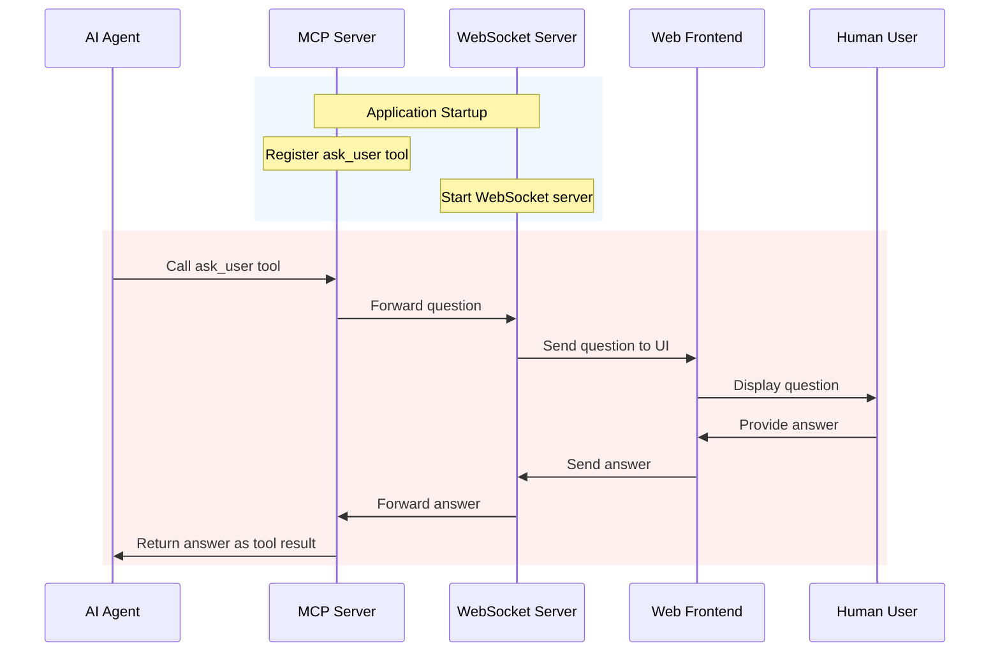

# Frontend Router MCP Design

## Overview
This document outlines the design for a Go application that serves as a bridge between AI agents and human users:
1. **MCP Tools Server**: Hosts MCP tools functionality, specifically the `ask_user` tool
2. **WebSocket Server**: Handles WebSocket connections from web frontends to relay user questions and answers

## Architecture Diagram



**Diagram Explanation**:
1. **Initialization Phase (Blue)**:
   - The application starts both the MCP server and WebSocket server
   - The MCP server registers the `ask_user` tool
   - The WebSocket server begins listening for frontend connections

2. **Ask User Flow (Pink)**:
   - An AI agent calls the `ask_user` tool via the MCP server
   - The question is forwarded to the WebSocket server
   - The WebSocket server sends the question to the connected frontend
   - The frontend displays the question to the human user
   - The user provides an answer through the frontend
   - The answer is sent back through the WebSocket server to the MCP server
   - The MCP server returns the answer as the result of the tool call

## Architecture

### Components

1. **Main Application**
   - Initializes and coordinates both servers
   - Manages shared resources and communication channels
   - Handles graceful shutdown

2. **MCP Server**
   - Implements the Model Context Protocol (MCP)
   - Registers and exposes the `ask_user` tool
   - Communicates with WebSocket server via channels
   - Uses the mark3labs/mcp-go library for MCP implementation

3. **WebSocket Server**
   - Manages WebSocket connections with frontend clients
   - Receives questions from the MCP server and forwards to frontend
   - Collects user answers and sends them back to the MCP server
   - Maintains client connection state

4. **AskUserTool**
   - Implements the MCP tool interface
   - Accepts a question parameter
   - Returns the user's answer as the tool result
   - Handles timeouts and error cases

## Communication Pattern

### Ask User Flow

1. **Tool Call Phase**
   - AI agent calls the `ask_user` tool with a question parameter
   - MCP server receives the tool call and creates a pending request
   - The question is forwarded to the WebSocket server
   - The request remains pending until the user responds or a timeout occurs

2. **User Interaction Phase**
   - WebSocket server sends the question to all connected frontends
   - Frontend displays the question to the user
   - User provides an answer through the frontend UI
   - Frontend sends the answer back to the WebSocket server

3. **Response Phase**
   - WebSocket server forwards the user's answer to the MCP server
   - MCP server completes the pending tool call with the user's answer
   - The answer is returned to the AI agent as the tool call result

### Message Structure

1. **Tool Call Message**
   ```json
   {
     "id": "unique-request-id",
     "type": "ask_user",
     "question": "What would you like to do today?"
   }
   ```

2. **User Response Message**
   ```json
   {
     "id": "unique-request-id",
     "type": "user_response",
     "answer": "I'd like to analyze some data."
   }
   ```

## Implementation Plan

1. **Project Structure**
   ```
   .
   ├── cmd/
   │   └── server/
   │       └── main.go         # Application entry point
   ├── internal/
   │   ├── mcpserver/         # MCP Tools Server
   │   └── wsserver/          # WebSocket Server
   ├── pkg/
   │   └── messaging/         # Shared message types and utilities
   └── go.mod
   ```

2. **Dependencies**
   - `github.com/gorilla/websocket` for WebSocket support
   - Standard library for HTTP server and concurrency primitives

## Next Steps
1. Set up the Go module
2. Implement the basic server scaffolding
3. Define the message protocol
4. Implement channel-based communication
5. Add WebSocket handler
6. Implement MCP tools handler
7. Add logging and error handling
8. Implement graceful shutdown

## Open Questions
- Authentication/authorization requirements?
- Rate limiting needs?
- Message size limits?
- Error handling strategy for disconnected clients?
